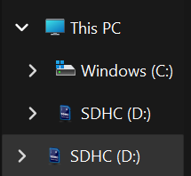
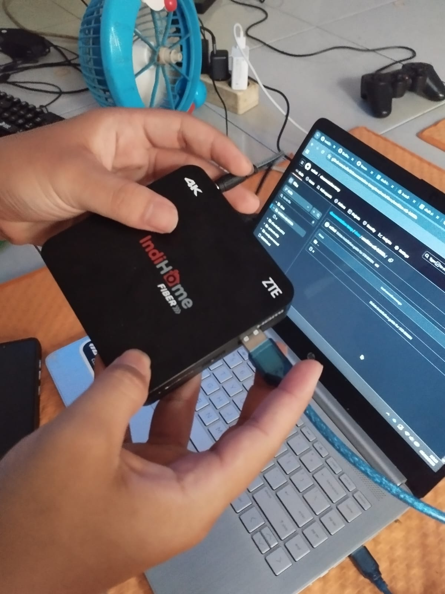
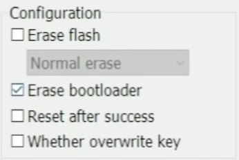
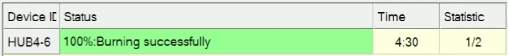

# preparation
1. STB B860H 
2. Memory Card microSD minimal 8Gb
3. Adapter microSD
4. USB male to male

## link file

[Download tar](https://drive.google.com/drive/folders/1uyD5fPBxR7_VSwl4v7qxVa4UN1C50l3A?usp=sharing)

# reset bootloader stb b860h

download folder reset-bootloader-b860h

## step 1

- masukkan sdcard ke dalam adapter sdcard
> pastikan sdcard adapter sudah terunlock


- lalu masukkan adapter sdcard ke dalam laptop
> jika tidak ada slot memorycard gunakan card reader



- buka folder installation-androidtv

- lalu buka folder BootcardMaker

- buka aplikasi BootcardMaker

- choose disk (sd card)

- centang bagian To partition and format

- choose your bin files: u-boot.bin

- klik tombol make

- lalu klik tombol start

- setelah selesai format sdcard

- jangan lupa untuk menutup aplikasi bootcardmaker

- copy semua file yang ada pada folder Unlock_USB ke sdcard yang sudah diformat

- setelah itu lepas sdcard dari laptop/pc 

## step 2

- buka aplikasi USB Burning Tool v2.2.0

- lalu pastikan usb male to male sudah tercolok pada laptop dan adaptor set top box sudah tercolok pada stop kontak sebelum kita sambungkan ke set top box

- sdcard masukkan ke dalam set top box

- sambungkan usb male to male friend dan adaptor set top box pada port usb 2


note: menyambungkan usb male to male friend dan adaptor set top box disambungkan atau dicolok secara bersamaan, dan ditekan tombol power set top box secara bersamaan

- lalu pastikan hasil pada aplikasi USB Burning Tool v2.2.0 hasilnya success conected
> biasanya perlu menunggu 1 hingga 2 menit, jika lebih dari itu maka coba ulang kembali

## step 3

- klik import image pada pojok kiri atas


- pilih image Pure-Khadas-VIM1.img pada folder reset-bootloader-b860h


- setelah selesai import, hilangkan ceklis pada Erase flash sebelah kanan aplikasi



- setelah itu klik tombol start

- jika sudah sampai error 1% dan tidak jalan lagi, klik tombol stop


- lepaskan kabel male to male, dan adaptor power dari set top box

## step 4

- sambungkan usb male to male friend dan adaptor set top box

note: menyambungkan usb male to male friend dan adaptor set top box disambungkan atau dicolok secara bersamaan, dan ditekan tombol power set top box secara bersamaan

-  setelah itu klik import image pada pojok kiri atas


- pilih image Pure-Khadas-VIM1.img pada folder reset-bootloader-b860h


- setelah selesai import, hilangkan ceklis pada Erase flash dan Erase Bootloader sebelah kanan aplikasi


- setelah itu klik tombol start

- tunggu sampai finish seperti dibawah



note: jika gagal ulangi dari step 1

- setelah finish, klik tombol stop

- sambungkan ulang usb male to male, dan adaptor power dari set top boxnya

note: menyambungkan usb male to male friend dan adaptor set top box disambungkan atau dicolok secara bersamaan, dan ditekan tombol power set top box secara bersamaan

- setelah menyambungkan ulang, kini sudah bisa langsung install android os untuk stb b860h

---

# installation base os

download folder installation-androidtv

## step 1

- setelah sukses mengembalikan bootloader b860h, buka folder FWAero_B860HV1&2_Android 6.0.0

- kemudian klik 2 kali pada file aeroflasher.bat


- klik tombol run

- setelah itu ketik angka 2 kemudian enter


- setelah itu cek pada bagian paling atas, apakah sudah ada device yang terscan

- kemudian jika sudah ada, klik spasi

- kemudian tunggu hingga selesai

- setelah selesai, ketik huruf e lalu enter untuk keluar dari terminal

## step 2

- setelah selesai, lepaskan male to male dari set top box

- hubungkan set top box ke monitor atau tv

- tunggu hingga selesai booting setelah selesai

- hubungkan mouse ke set top box

- sambungkan wifi pada android os tv

- maka sudah berhasil menginstall android pada set top box

- keluarkan microsd dari set top box

---

# installation armbian-debian

download folder step 2

## step 1

- masukkan sdcard ke dalam adapter sdcard

- masukkan adapter sdcard ke dalam laptop/pc

- buka aplikasi rufus

- klik tombol pilih/select
  
- kemudian pilih file Armbian_5.91_Aml-s905_Debian_buster_default5.1.0.img pada folder Armbian_5.91_Aml-s905_Debian_buster_default5.1.0.img

- klik tombol start

- setelah itu munucul peringatan

- klik ok

- kemudian tunggu

- setelah selesai klik tombol tutup

## step 2

- buka microsd pada file manager

- kemudian buka folder extlinux

- buka file extlinux.conf menggunakan text editor
> disarankan menggunakan visual studio code
- lalu pada line # FDT /dbt/meson-gxl-s905x-khadas-vim.dtb

```extlinux.conf
LABEL Armbian
  LINUX /zImage
  INITRD /uInitrd
  FDTDIR /dtb
#  FDT /dtb/meson-gxl-s905x-khadas-vim.dtb
  APPEND root=LABEL=ROOTFS rootflags=data=writeback rw console=ttyAML0,115200n8 console=tty0 no_console_suspend consoleblank=0 fsck.fix=yes fsck.repair=yes net.ifnames=0 
```

- hapus # dan ganti menjadi FDT /dbt/meson-gxl-s905x-p212.dtb

```extlinux.conf
LABEL Armbian
  LINUX /zImage
  INITRD /uInitrd
  FDTDIR /dtb
  FDT /dbt/meson-gxl-s905x-p212.dtb
  APPEND root=LABEL=ROOTFS rootflags=data=writeback rw console=ttyAML0,115200n8 console=tty0 no_console_suspend consoleblank=0 fsck.fix=yes fsck.repair=yes net.ifnames=0 
```

- lalu save

## step 3

- lalu edit file uENV.ini menggunakan text editor
> disarankan menggunakan visual studio code

```uENV.ini
dtb_name=/dtb/meson-gxl-s905x-khadas-vim.dtb
bootargs=root=LABEL=ROOTFS rootflags=data=writeback rw console=ttyAML0,115200n8 console=tty0 no_console_suspend consoleblank=0 fsck.fix=yes fsck.repair=yes net.ifnames=0
```

- lalu ganti menjadi dtb_name=/dtb/meson-gxl-s905x-p212.dtb

```uENV.ini
dtb_name=/dbt/meson-gxl-s905x-p212.dtb
bootargs=root=LABEL=ROOTFS rootflags=data=writeback rw console=ttyAML0,115200n8 console=tty0 no_console_suspend consoleblank=0 fsck.fix=yes fsck.repair=yes net.ifnames=0
```

- kemudian file uboot_HG680P.bin dicopy dan dipaste ke dalam microsd

- kemudian rename file uboot_HG680P.bin menjadi bootloader.bin

- lalu eject microsd

## step 4

- kita ke android pada set top box, buka file manager

- lalu buka boot 

- klik tombol sebelah icon home untuk bisa memilih file

- kemudian cari file bootloader.bin

- setelah itu klik lagi 2 tombol dari icon home untuk bisa mengcopy file yang telah dipilih

- lalu pencet tombol icon home

## step 5

- buka folder localdisk

- kemudian buka folder Download

- paste file dengan mengklik 2 tombol dari icon home

## step 6

- setelah itu buka aplikasi emulator terminal

- kemudian masuk ke dalam root dengan menggunakan command 

```
su
```

- setelah itu masuk ke folder download pada localdisk

```
cd sdcard/download
```

- lalu cek apakah ada file bootloadet.bin

```
ls
```

- kemudian masukkan command berikut

```
dd if=bootloader.bin of=/dev/block/bootloader
```

- jika berhasil maka akan keluar records in dan records out

- setelah itu restart set top box 

```
reboot
```

## step 7

- setelah itu tunggu selesai booting

- setelah selesai masukan password root
note: password root = 1234

- setelah itu akan diminta untuk mengubah password root

- untuk mengubah password root akan diminta password yang awal

- kemudian masukkan password yang diinginkan, setelah itu masukkan kembali

## step 8

- setelah itu akan membuat user

- kemudian akan diminta untuk nama username yang diinginkan

- setelah itu masukkan password untuk user, setelah itu masukkan kembaki passwordnya

- lalu akan diminta informasi masukkan saja sesuai keinginan, bisa dikosongkan dengan cara langsung dienter saja

**selamat anda telah berhasil menginstall linux pada set top box**

# installation gui for armbian

## step 1

```
armbian-config
```

- ketik enter

- pilih Network

- pilih Wifi
note: untuk wifi harus menggunakan dongle wifi untuk armbian

- lalu pilih jaringan yang diketahui

## step 2

- setelah itu ke Personal

- Pilih Timezone

- Pilih Asia

- Pilih Jakarta

## step 3

- pilih Mirror

- pilih mirror.tuna.tsinghua.edu.cn/armbian/ China

## step 4 

- pilih system

- pilih Firmware

- pilih yes

- lalu ketika disuruh reboot pilih yes

## step 5

- kita akan mengupdate source untuk package dari armbian debian buster

```
sudo nano /etc/apt/source.list
```

- untuk isinya kita berikan # pada setiap line

- tambahkan di line berikutnya seperti dibawah

```
deb [trusted=yes] http://archive.debian.org/debian buster main contrib non-free
deb [trusted=yes] http://archive.debian.org/debian-security buster/updates main contrib non-free
deb [trusted=yes] http://archive.debian.org/debian buster-backports main contrib non-free
```

- lalu save menggunakan ctrl + x

- kemudian klik s, dan enter

## step 6

- setelah itu ketik

```
sudo apt update && apt upgrade
```

- setelah itu reboot

```
reboot
```

## step 7

- setelah login kembali install gui yang diinginkan dibawah

**xfce**
```
sudo apt install task-xfce-desktop
```

**lxde**
```
sudo apt install task-lxde-desktop
```

**lxqt**
```
sudo apt install task-lxqt-desktop
```

**mate**
```
sudo apt install task-mate-desktop
```

**gnome**
```
sudo apt install task-gnome-desktop
```

- setelah menjalankan salah satu gui diatas, ketik Y untuk mengkonfirmasi

## step 8

- setelah selesai install, lakukan update dan upgrade kembali

```
sudo apt update && apt upgrade
```

- setelah itu lakukan reboot

```
reboot
```

- jika berhasil akan langsung masuk ke dalam tampilan yang dipilih sebelumnya

---


# ssh x11 forwarding

## configure sshd config
> on target pc
```
sudo nvim /etc/ssh/sshd_config
```

```
X11forwarding yes
AllowTcpForwarding yes
X11UseLocalhost yes
X11DisplayOffset yes
```

## add file .Xauthority

```
touch ~/.Xauthority
```

```
xauth generate :0 . trusted
```

```
xauth add ${HOST}:0 . $(xxd -l 16 -p /dev/urandom)
```

```
xauth list
```

## connect ssh
> on local
```
ssh -v -Y [user]@[ip server]
```

## then run the application
> example for firefox
```
firefox -no-remote
```

# open browser with terminal

## install kiosk

```
sudo apt install firefox-esr fluxbox
```

## opening web
> example browsing facebook using terminal
```
firefox-esr --kiosk "https://facebook.com"
```
